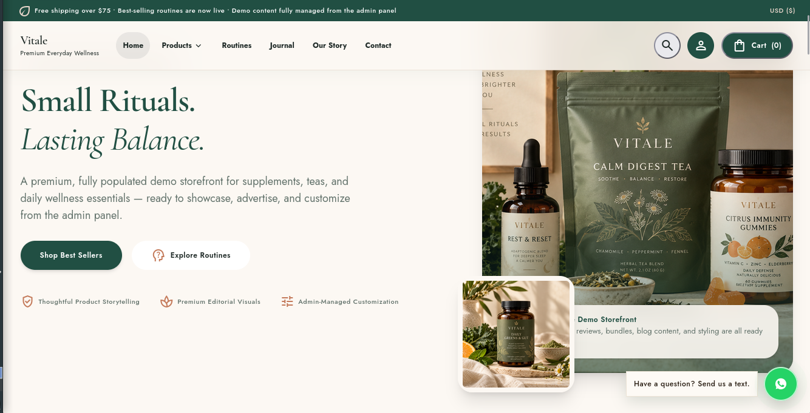
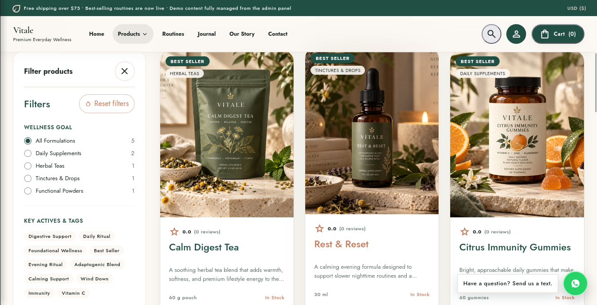
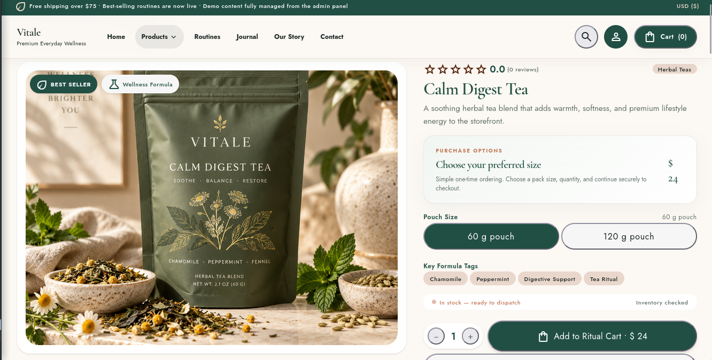
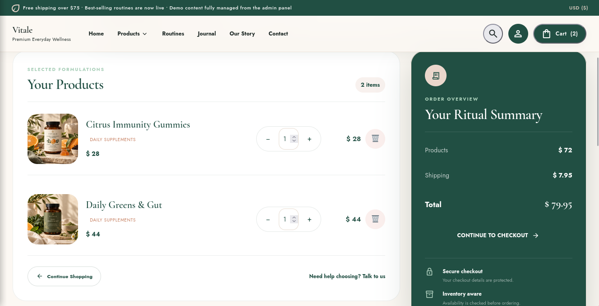
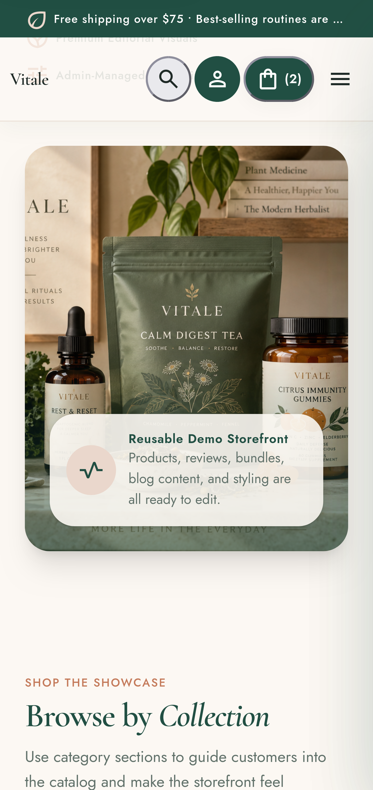

# Vitale Wellness Ecommerce CMS Lite

A free, reusable **Node.js ecommerce CMS starter** for wellness, supplements, health and beauty stores.

Built with **Node.js, Express, EJS and MongoDB**.

## Full Edition Preview

> The screenshots below show the premium Full Edition. Vitale Lite contains the essential ecommerce flow with a simplified interface and feature set.

### Storefront


### Products


### Product Details


### Cart


### Mobile Storefront


## Lite Features

- Admin setup and secure login
- Product add/edit/delete
- Categories
- Local product image uploads
- Basic price and stock management
- Responsive storefront
- Product search and category filtering
- Shopping cart
- Guest checkout
- Cash on Delivery / manual orders
- Order management and status updates
- Automatic stock handling
- Basic SEO meta tags

## Tech Stack

**Node.js · Express.js · MongoDB · Mongoose · EJS · HTML · CSS · JavaScript**

## Lite vs Full Version

Vitale Lite focuses on the essential ecommerce workflow.

The **Full Edition** adds advanced features such as theme customization, homepage controls, customer accounts, Stripe/PayPal, bundles, blog CMS, advanced variants and inventory, Cloudinary, email/SMTP, CSV tools, backup/restore, advanced SEO, analytics and additional CMS controls.

### Get the Full Version

**[Buy Vitale CMS Full Edition on Lemon Squeezy](https://whop.com/burhan-builds/wellness-store-cms-with-admin-panel/)**

## Quick Start

```bash
git clone https://github.com/burhan-197/vitale-wellness-ecommerce-cms.git
cd vitale-wellness-ecommerce-cms
npm install
npm start
```

Copy `.env.example` to `.env`, configure MongoDB and `SESSION_SECRET`, then open:

```text
http://localhost:3000/admin/setup
```

Create the administrator, add a category and start adding products.

## Product Images

Lite uses local JPG, PNG and WebP uploads with **one image per product** and a **5 MB maximum size**.

## Checkout

Vitale Lite uses **guest checkout** with Cash on Delivery / manual order placement. No customer account is required.

---

If you find Vitale Lite useful, consider giving the repository a **⭐ star**.
